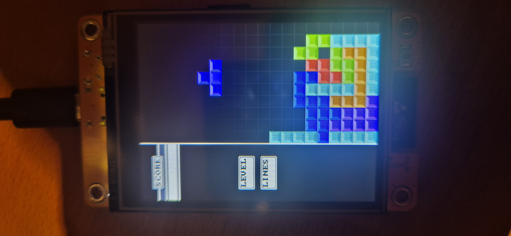

# CYD Tetris

A Tetris clone written for the "Cheap Yellow Display" board (ESP32-2432S028R). The board handles the game logic and drawing, and since it has no built-in keyboard, a small Python script on your PC forwards keypresses to it over serial.

## What's in this repo

- **`cheap_esp32_board_tetris_using_pc/cheap_esp32_board_tetris_using_pc.ino`** - the actual game. Runs on the ESP32, draws everything to the 240x320 TFT over `TFT_eSPI`, and listens on the serial port for key press/release messages.
- **`python_keyboard_to_esp/main.py`** - a keyboard-to-serial bridge. Runs on your computer, listens globally for key presses with `pynput`, and forwards them to the board over a serial connection (`pyserial`). Logs everything to `esp32_comm.log` for debugging.

These two files are meant to be used together - the ESP32 has no keyboard of its own, so `main.py` is what actually lets you play.

## How it works

### On the board
- A 10x20 block grid is drawn on the right side of the screen, with an info panel (score/level/lines containers) on the left.
- Standard tetromino shapes (I, O, J, L, S, Z, T) are represented as bit patterns and rotated with basic SRS-style wall kick tables.
- Falling, moving, hard/soft dropping, rotating, and line clearing are all implemented - when a row fills up it's cleared and everything above shifts down.
- Blocks are drawn with a simple beveled/3D look (lighter top-left, darker bottom-right) rather than flat squares.
- Every 5ms the board checks for a new line of serial input and updates its internal key-state table (`keyboardKeyStates`) accordingly. The main loop reads from that table to move/rotate/drop the current piece.

### On the PC
- `main.py` opens a serial connection to the configured COM port and starts two threads: one to read from serial (for debug/logging), one to write to it.
- A `pynput` keyboard listener captures every key press/release on your computer and pushes a `DOWN:<key>` or `UP:<key>` message into a queue, which the writer thread sends over serial.
- **Note:** because `pynput` listens globally, keys are captured even if the terminal/game isn't focused - so don't leave this running while typing elsewhere.
- Only one program can hold the serial port at a time - don't run the Arduino Serial Monitor while `main.py` is running, and vice versa.

### Controls
| Key | Action |
|---|---|
| A / ← | Move left |
| D / → | Move right |
| S / ↓ | Soft drop |
| W / ↑ | Rotate clockwise |
| Z | Rotate counter-clockwise |
| Space | Hard drop |
| C | Hold (mapped, not implemented yet) |

## Setup

1. Configure the `TFT_eSPI` library for your board (read its documentation on how to configure)
2. Flash the `.ino` file to your ESP32.
3. On your PC, setup python environment and install dependencies: `pip install pynput pyserial`
4. Open `main.py` and set `SERIAL_PORT` to whatever port the board shows up as (e.g. `COM5` on Windows, `/dev/ttyUSB0` on Linux).
5. Run `main.py`, then start playing - keystrokes on your keyboard get sent to the board in real time.

## What's missing / known issues

- **No score, level, or line tracking.** The containers and labels ("SCORE", "LEVEL", "LINES") are drawn, but nothing ever writes numbers into them - the game doesn't count cleared lines or increase speed over time.
- **No next-piece preview.** Next piece preview is not yet implemented
- **Hold piece isn't implemented.** The holding key (`C`) is bound, but currently no holding logic is implemented.
- **No game over detection.** If blocks stack to the top, the game does not register and the board resets due to a segfault caused by writing blocks outside of the grid.
- **No pause or start menu.** No menu / pause whatsoever, the game starts immediately on boot.
- **No score / levels** No score or levels are being tracked, so you're playing endlessly on the same difficulty
- **Drop speed is fixed** at 1 second per row regardless of level, since there is no level system yet.
- **Fragile serial protocol** - input parsing assumes well-formed `DOWN:key` / `UP:key` lines; malformed input is logged but otherwise ignored, and there's no reconnect/handshake logic on the board side if the PC bridge disconnects mid-game.